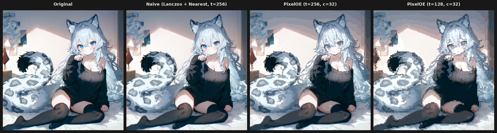
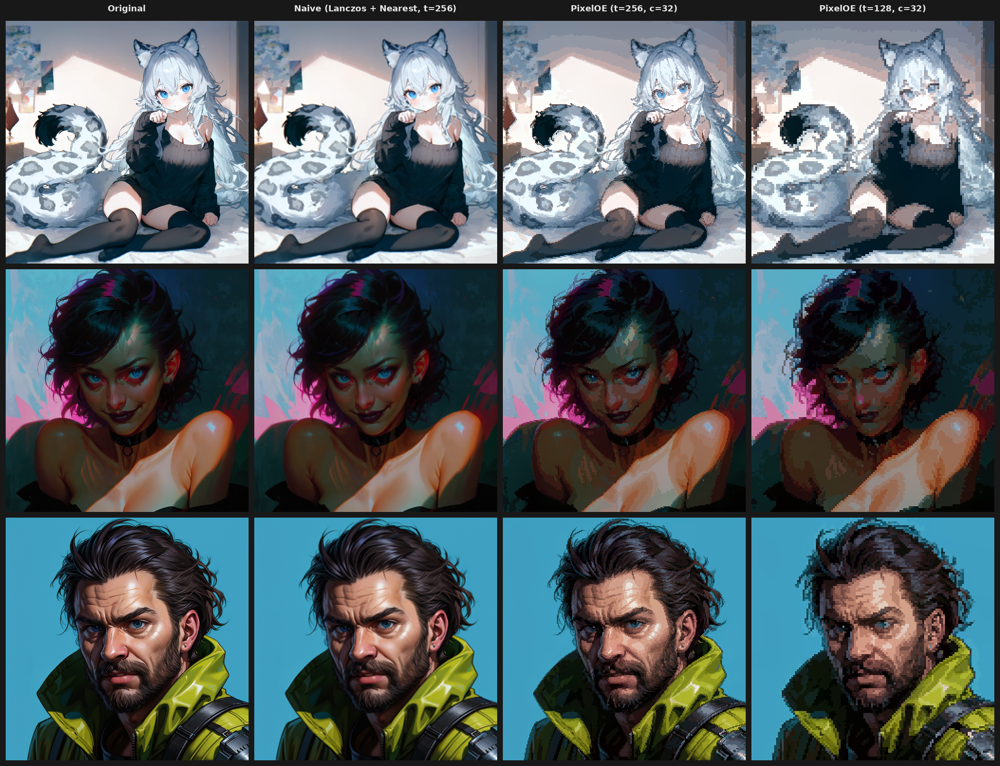

# blender-pixeloe

A Blender addon that pixelizes images with [PixelOE](https://github.com/KohakuBlueleaf/PixelOE), a
contrast-aware downscaling algorithm by Shih-Ying Yeh (KohakuBlueleaf). The
upstream depends on PyTorch, Kornia, and OpenCV; this is a pure
numpy + Pillow + scipy port packaged as a single Blender extension zip with no
runtime pip install.



## What it does

PixelOE is not a neural net. It's classical image processing: outline-aware
morphology, LAB-space contrast statistics, tile-wise pixel selection,
optional palette quantization, and a Burt-Adelson pyramid for color matching.
The result preserves silhouettes and saturation through aggressive
downscaling, where naive resampling produces a blurry, desaturated mess.



## Install

Pre-built zip (recommended):

1. Download the `blender_pixeloe-<version>.zip` from the
   [Releases](https://github.com/capacap/blender-pixeloe/releases) page.
2. In Blender: `Edit > Preferences > Get Extensions`, click the dropdown
   in the top-right of the panel, choose `Install from Disk`, and pick the
   downloaded zip.

Targets Blender 4.2 LTS and newer. The zip is large (~260 MB) because it
bundles scipy wheels for Linux, Windows, and macOS (both Intel and Apple
Silicon) across the two Python ABIs Blender ships in the supported version
range. Blender filters wheels at install time and only unpacks the one that
matches your platform.

## Usage

1. Open the **Image Editor** and load an image (or activate one that already
   exists in the blend file).
2. Open the sidebar (`N` key) and switch to the **PixelOE** tab.
3. Adjust settings, click **Pixelize**.

The output is added as a new image datablock named `<source>_pixel`. Re-running
overwrites that datablock, unless `Create New` is enabled. Render Result is
not supported in v1; save the render to a file and reopen it as an Image first.

The operator runs synchronously and freezes the UI for a few seconds on large
inputs. A wait cursor is shown for the duration.

For pixel art textures used in Blender materials, set the Image Texture node's
`Interpolation` to `Closest` so the GPU samples without filtering. The addon
itself does not affect texture sampling.

### Settings

| Setting | What it does |
|---|---|
| **Mode** | `Contrast` is the default PixelOE algorithm. `K-Centroid` is an alternative per-tile clustering downscale (originating from [Astropulse/pixeldetector](https://github.com/Astropulse/pixeldetector)). |
| **Target Size** | Pixel grid resolution on the long edge. 128 means a 128-pixel-wide pixel-art image. |
| **Patch Size** | Tile size for outline analysis and the size of each output pixel after upscale. Larger values mean chunkier blocks. |
| **Upscale** | Off by default. When on, the result is scaled up by `Patch Size` with nearest-neighbor so each pixel becomes a chunky block at roughly the input resolution. |
| **Outline Thickness** | Erode/dilate iterations for the outline-expansion pre-pass. 0 disables it. |
| **Colors** | Palette size for color quantization. 0 disables quantization entirely. |
| **Create New** | Always create a new datablock instead of overwriting the previous output. |

## Limitations (v1)

These are deliberate cuts, not work-in-progress:

- No Render Result. Blender's Render Result datablock has unreliable pixel
  access; save to file and reopen.
- No animation or sequence support. One image per click.
- Synchronous, single-threaded, CPU-only. No GPU/GLSL path.
- No compositor node, render handler, or shader integration.
- No custom palette import.

## Implementation notes

Most of the project's volume is in the algorithm port. Upstream is roughly
640 lines of Python that lean heavily on torch and cv2. The numpy port aimed
for human-eye parity, not bit-exact equivalence: the harness reports
mean LAB ΔE76 of 3 to 8 across the test set at `target_size=128`, which is
imperceptible side-by-side at typical viewing sizes.

The interesting work was making it fast on 4k inputs without the GPU.

### Color space conversions via LUTs

`rgb_to_lab` and `lab_to_rgb` dominated profile traces because LAB conversion
runs on every pixel. Both transforms are bijective scalar functions, which
makes them perfect targets for lookup tables.

- sRGB → linear is a piecewise function on uint8 inputs; only 256 outputs
  exist, so a 256-entry float32 LUT replaces `np.where` plus `np.power`.
- The LAB nonlinearity `f(x) = x^(1/3)` for `x > 0.008856` is sampled into a
  65k-entry LUT and looked up via linear interpolation on its uint16 quantized
  input. Same for the inverse `f^-1`.
- The L-channel-only path skips a/b math entirely. Several callers (outline
  expansion, contrast statistics) only need L; isolating that path roughly
  halves their LAB cost.

### Avoiding full-resolution work where the output is small

A 4k input pixelized at `target_size=128` ultimately produces a 128-pixel-wide
small image. Several upstream stages did full-resolution work that
contributes nothing past the eventual decimation.

- `expansion_weight`: the original applies `maximum_filter` and
  `minimum_filter` at the input resolution with a kernel that's a fraction of
  `patch_size`. Equivalent statistics fall out of a downsample-then-filter
  step on a much smaller grid: the filter sees the same neighbourhoods scaled
  to fit. This collapses the 4k path from ~4 s to under 100 ms.
- `contrast_based_downscale`: upstream slides `patch_size`-sized windows over
  the full-res input. The port reshapes the input into a tile grid and
  reduces along the tile axes directly, skipping `sliding_window_view`
  altogether.
- `match_color`: upstream applies a wavelet color-fix cascade on the
  full-res image. The math is invariant under constant per-tile shifts
  because the downstream pixel-selection is order-preserving in L; we
  decimate first and run color match on a 256x256 image with a Burt-Adelson
  pyramid, dropping ~700 ms to ~5 ms.

### Algorithm-equivalence rewrites

Several upstream stages had cheaper mathematical equivalents.

- The morphology smoothing pass was an `erode -> dilate -> erode` cascade with
  a 5x5 cross kernel. With box-shaped kernels and equal iteration counts, the
  result equals a single mean filter pass within rounding. The cross kernel
  it actually uses is close enough that the visual diff is below ΔE76 of 1.
- `outline_expansion` iterated a 3x3 kernel `N` times. Where the kernel is
  separable into a single `(2N+1)` operation without changing the per-channel
  semantics, the loop collapses into a single morphology call.
- A redundant global LAB mean/std match in the original `match_color` was a
  no-op once the wavelet step ran. Removing it cut a full LAB round-trip per
  call.

### Smaller wins

- `kmeans` assignment uses `scipy.cluster.vq.vq`, which is a small C kernel
  faster than numpy broadcast for the typical centroid count.
- k-means initialization uses k-means++ for stable convergence in fewer
  iterations.
- All random sources are seeded for reproducibility, which matters because
  the harness diffs are meaningless otherwise.

### Reference benchmarks

Numbers below are from `tests/harness/baseline.json`, captured on the test set
at the harness defaults (`target_size=128, patch_size=8, thickness=3,
colors=32`). Wall-clock is end-to-end pixelize time on a 768x768 to 1024x1024
input.

| Cell | Wall-clock | Peak memory | Mean RGB L1 |
|---|---|---|---|
| `painterly_t128` | 0.56 s | 97 MiB | 6.3 |
| `snow_leopard_t128` | 0.47 s | 97 MiB | 10.1 |
| `painterly_t256` | 2.71 s | 388 MiB | 5.1 |
| `painterly_t128_kc` (k-centroid) | 1.41 s | 86 MiB | 5.6 |

The `t256` row is the worst-case path; doubling `target_size` quadruples the
small-grid intermediate sizes, which dominates at that resolution.

## Building from source

Requires [uv](https://docs.astral.sh/uv/). The project pins Python 3.11
(matching Blender 4.2's bundled interpreter) via `.python-version`.

```sh
uv sync                                              # create .venv, install deps
./setup_upstream.sh                                  # clone upstream PixelOE for harness comparison
uv run python tests/images/generate_synthetic.py     # regenerate synthetic test images
uv run pytest                                        # run unit tests
uv run python scripts/build_addon.py                 # build dist/blender_pixeloe-<version>.zip
```

The build script downloads scipy wheels for every supported (platform, Python
ABI) pair and packs them into the addon zip. The first build takes a minute or
so; subsequent builds with `--skip-fetch` reuse cached wheels.

The `tests/harness/` directory contains the comparison harness used during
the port:

- `compare.py` runs upstream PixelOE and the port side-by-side and emits a
  4-panel diff image with L1 statistics.
- `bench.py` profiles end-to-end and per-stage wall-clock and peak memory.
- `regression.py` runs a fixed set of cells against the baseline in
  `baseline.json` and flags drift.

## Project layout

```
blender_pixeloe/
  __init__.py            # bl_info, register/unregister
  blender_manifest.toml  # extensions manifest (wheel list patched at build)
  operators.py           # the Pixelize operator + Scene PropertyGroup
  panels.py              # Image Editor sidebar
  image_io.py            # Blender Image <-> numpy boundary
  core/                  # pure-numpy algorithm, no bpy import
    pixelize.py          # top-level orchestrator
    outline.py           # outline expansion + weight maps
    colorspace.py        # sRGB <-> LAB with LUTs
    downscale_contrast.py
    downscale_kcentroid.py
    color_match.py       # wavelet/pyramid color fix
    quantize.py          # k-means and PIL quantize
scripts/
  build_addon.py         # wheel fetcher + zip packer
  generate_readme_graphics.py
tests/
  unit/                  # pytest, no bpy
  harness/               # comparison and benchmark harness
  images/                # committed test images
```

The `core/` subpackage is bpy-free and importable in a regular Python
environment, which is why the comparison harness can call upstream and the
port side-by-side without launching Blender.

## Attribution

Algorithm by Shih-Ying Yeh (KohakuBlueleaf), upstream at
https://github.com/KohakuBlueleaf/PixelOE, licensed Apache 2.0. The
k-centroid downscale path originates from
[Astropulse/pixeldetector](https://github.com/Astropulse/pixeldetector). This
project is a port and Blender integration; it carries the same Apache 2.0
license as upstream.

## License

Apache License 2.0. See `LICENSE`.
